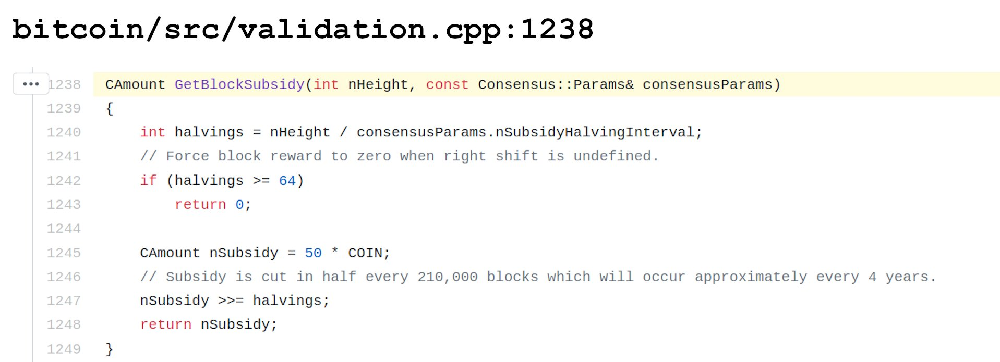

## 21 Millones de Bitcoin
Bitcoin se crea, como se describe en las páginas anteriores, cuando una computadora que ejecuta el proceso de minería, resuelve una tarea computacional y es la primera en adjuntar con éxito el bloque recién acuñado a la cadena.

Los mineros actualmente reciben una recompensa de 6.25 bitcoins por este trabajo. Esta recompensa es el incentivo para que los mineros se comporten positivamente con la red Bitcoin y no hagan trampa para cambiar las transacciones a su favor.

### El "Halving": La Reducción a la Mitad
Las reglas de Bitcoin estipulan que la recompensa para los mineros se reducirá a la mitad cada 210.000 bloques, aproximadamente cada cuatro años. Al principio, esta recompensa era de 50 bitcoins. Desde mayo de 2020 es 6.25 bitcoins. En 2024, esta recompensa se reducirá a la mitad para pasar a ser 3,125 bitcoins por bloque. Este evento se llama comúnmente "el Halving" o la "Reducción a la Mitad".

Satoshi Nakamoto codificó estas mitades en el software del cliente base de Bitcoin (o el "Bitcoin Core"). La cantidad de producción disminuye con el tiempo, lo que resulta en una curva de oferta aplanada.

[^24]

Este algoritmo tiende a cero, por lo que solo habrá un máximo de 21 millones de bitcoins. Actualmente hay alrededor de 18,7 millones en circulación. En 2.140 se habrán acuñado los 21 millones de bitcoins. La minería continuará y los mineros serán recompensados únicamente con las comisiones de las transacciones. En ese momento, se espera que Bitcoin como red tenga una adopción tan alta que las tarifas de transacción por sí solas faciliten adecuadamente una recompensa justa para los mineros.

[^25]

### ¿Por qué 21 millones?
¿Por qué Satoshi Nakamoto eligió 21 millones para el límite de suministro? Hay muchas teorías, pero aquí está la respuesta de Satoshi:

[^26]

>“Mi elección para la cantidad de monedas y el programa de distribución fue una suposición fundamentada. Fue una elección difícil, porque una vez que la red está funcionando, se bloquea y nos quedamos atrapados. Quería elegir algo que hiciera que los precios fueran similares a las monedas existentes, pero sin saber el futuro, eso es muy difícil. Terminé eligiendo algo que se encontraba en un punto intermedio. Si Bitcoin sigue siendo un nicho pequeño, valdrá menos por unidad que las monedas existentes. Si te imaginas que se usará para una fracción del comercio mundial, entonces solo habrá 21 millones de monedas para todo el mundo, por lo que valdría mucho más por unidad. Los valores son números enteros de 64 bits con 8 posiciones decimales, por lo que 1 moneda se representa internamente como 100000000 unidades. Hay mucha granularidad, si los precios típicos se vuelven pequeños. Por ejemplo, si 0,001 vale 1 euro, entonces podría ser más fácil cambiar dónde se muestra el punto decimal, por lo que si teníamos 1 Bitcoin ahora se muestra como 1000 y 0,001 se muestra como 1”.

### Las Unidades de Bitcoin
La unidad de denominación más pequeña de un bitcoin es un satoshi. 1 bitcoin se compone de 100.000.000 (cien millones) de satoshis; 1 satoshi es la cien millonésima parte de 1 bitcoin (0,00000001).

No tienes porque comprar o vender 1 bitcoin a la vez; puedes comenzar poco a poco y realizar transacciones con una fracción minúscula.

### Bitcoin o bitcoin, pero nunca BitCoin

Bitcoin con una B mayúscula se usa cuando se hace referencia a la red Bitcoin, la cadena de bloques, la comunidad y el concepto en su conjunto, mientras que bitcoin con una b minúscula se usa para hacer referencia a la moneda, el token de bitcoin.

De hecho, la moneda es el término incorrecto para describir el activo digital, es un poco engañoso. En términos técnicos, la moneda se llama UTXO: de sus siglas en ingles; "salida de transacción sin gastar". Una UTXO define la cantidad de valor que se almacena en la cadena de bloques en una dirección de Bitcoin específica. Por lo tanto, hay opiniones divergentes sobre si hay un plural para bitcoin, la unidad, porque es fluido y no hay monedas individuales establecidas. Pero dado que Satoshi Nakamoto habló de bitcoins, nosotros, como comunidad, también lo llamamos de esa manera. No hay plural para Bitcoin, ya que solo hay una cadena de bloques y una red.

Las estafas como la red BitClub se refieren a ella como BitCoin y esto a menudo también es utilizado por error por los principiantes de Bitcoin.

[^24]: [Fuente Andreas M. Antonopoulos] (https://twitter.com/aantonop/status/1257366095515848716?s=20)  
[^25]: [Fuente: Insti] (https://commons.wikimedia.org/wiki/File:Total_bitcoins_over_time.png)  
[^26]: [Fuente plan99.net] (https://plan99.net/~mike/satoshi-emails/thread1.html)
